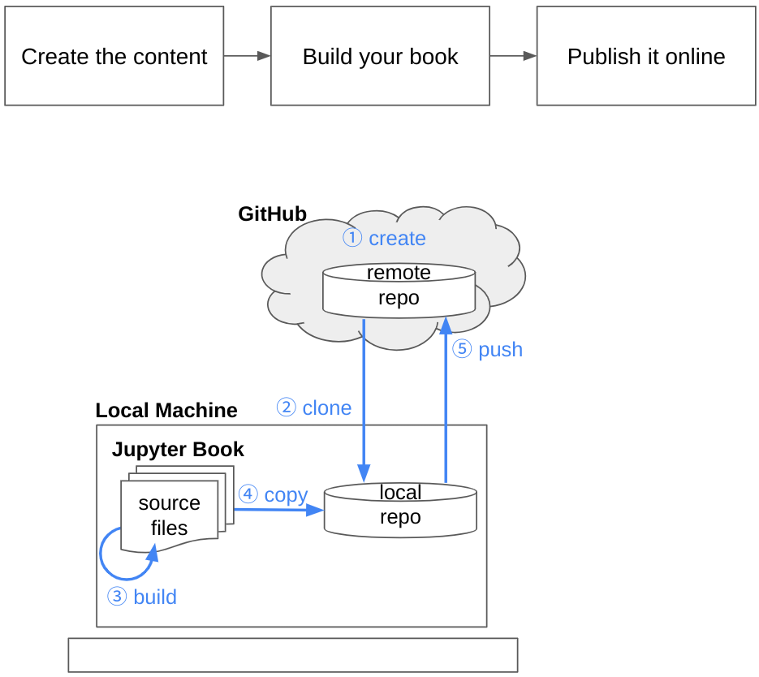

# A Practical Guide to Machine Learning with Google Cloud

- Created: 2024-12-11 (Wed)
- Updated: 2025-02-05 (Wed)

This repository contains the files for a Jupyter Book project. The published book can be viewed at [https://aimldl.github.io/vertex-ai/](https://aimldl.github.io/vertex-ai/)

## Setting up this Jupyter Book project
Details on setting up this Jupyter Book project are available in these guides:
- [A Quick Start to Jupyter Book](https://docs.google.com/document/d/1PXdBtuoIniWVbuAqwCFzM44fuYRyVbnd84CvRVcIA3M/edit?tab=t.0#heading=h.nghxr9spi7kt)
- [Happy Book Writing with Jupyter Book for a Programmer](https://docs.google.com/document/d/1XQWcRHX990Od6lShArrVzlKUOTdtHs3uFVqvJEp8rqM/edit?tab=t.0)



The following instructions assume the project is already configured.

## Building the Book

The book building process involves three steps:

1. **Content Creation:** Create the content and organize it using folders, files, and a configuration file.
2. **Book Building:** Generate the book in either HTML or PDF format.
3. **Publishing:** Deploy the generated book online.

## Updating Content
Open a terminal to update the book's content locally.

```bash
(base) $ conda activate jb
(jb) $ cd ~/github/vertex-ai
(jb) $ git pull

# Launch JupyterLab
(jb) $ jupyter lab
```

## Building the Book
Open a separate terminal and execute the following commands:
```bash
(jb) $ jb clean . --all
(jb) $ jb build .

# Optional: View the built book locally
(jb) $ google-chrome _build/html/index.html
```

## Pushing Changes to the Remote Repository
```bash
(jb) $ cd ~/github/vertex-ai
(jb) $ jb clean . --all
(jb) $ jb build .

# Prerequisite: The remote repository has already been configured.
(jb) $ git add ./*
(jb) $ git commit -m "Update the content"

# See below for a secure way to handle tokens.
(jb) $ cat ../token
(jb) $ git push
```
Consider a more secure way to handle tokens than `cat ../token`. For example, use environment variables or a dedicated secrets management solution.

## Publishing the Book

```bash
(jb) $ ghp-import -n -p -f _build/html/
```
The published book will be available at https://aimldl.github.io/vertex-ai/
