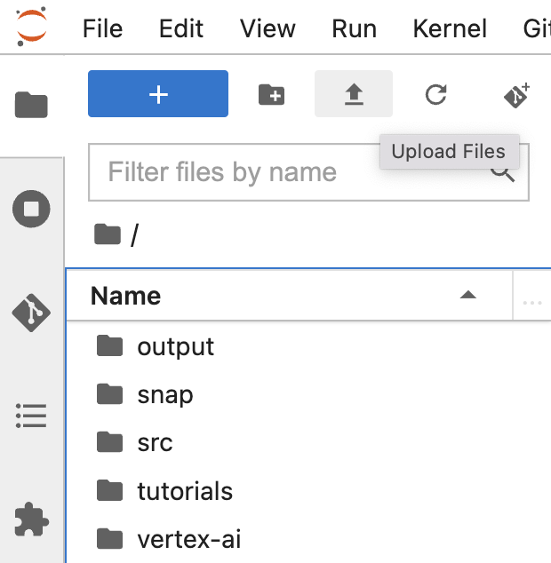
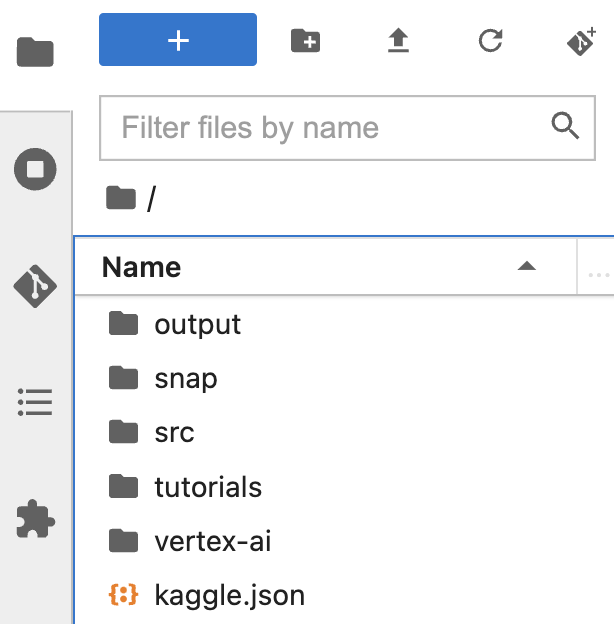

# README
* First written: 2022-03-24 (Thu)

Step 1. Upload your Kaggle API credentials `kaggle.json`.
Click the upload button and select `kaggle.json`


`kaggle.json` is located in the user home directory.



Step 2. Execute `run`
The prerequisite to execute `run` is to get `kaggle.json` in advance.
`run` takes care of `kaggle.json` assuming it's located in the user home directory.

`kaggle.json` is necessary because the ImageNet dataset is downloaded from Kaggle.

```bash
$ chmod +x run
$ ./run
```
which will automatically execute the rest of Bash scripts.
```bash
$ ./create_conda_virtual_environment
$ ./prep_to_run_vit
$ ./run_vit
```
